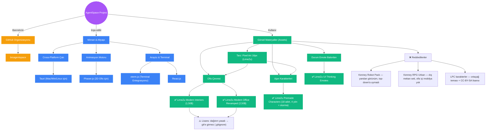

# Proje Bilgi Grafiği (Local Knowledge Graph)

Bu doküman, AgentSpace projemiz için yaptığımız tüm araştırmaları, kararları ve mimari bileşenleri birbirine bağlayan yerel (local) bilgi grafiğimizdir. Tıpkı Google Cloud Knowledge Catalog'da olduğu gibi, bu grafiği projenin hafızası olarak kullanacağız. Yeni araştırmalar yaptıkça bu grafiği güncelleyeceğim.

## 🧠 Görsel İlişki Ağı (Context Graph)

Aşağıdaki grafikte şu ana kadar aldığımız kararların ve araştırmaların birbiriyle olan ilişkisini görebilirsiniz:

## 📋 Varlık Kataloğu (Entity Catalog)

Grafikteki her bir düğümün (node) detaylı teknik bağlamı:

### 1. Mimari (Architecture)
- **Tauri:** Uygulamayı Mac, Windows ve Linux'ta tüy gibi hafif çalıştırmak için seçtiğimiz ana motor.
- **Phaser.js:** Ajanların masalara oturması, yürümesi ve ofis içinde etkileşime girmesi için kullanılacak 2D oyun/simülasyon motoru.
- **React + xterm.js:** Çoklu terminal ekranlarını ve kullanıcı arayüzünü oluşturmak için kullanılacak web teknolojileri.

### 2. Görsel Materyaller (Assets) — v2 (2026-08-18, UYGULANDI ✅)
- **Tarz:** 16px pixel art, tek tutarlı aile: **LimeZu Modern Interiors + Modern Office Revamped** (toplam ~4$, itch.io). Muratify referans görünümünün kaynağı bu paketlerdir.
- **Ajanlar:** LimeZu premade **insan** karakterleri (robot kararı iptal — bkz. DECISIONS.md §14). 18 karakter; idle/walk 4 yön, masada oturma, telefon animasyonları. "Ajan Ekle" modalında karakter seçici var.
- **Çevre/Ofis:** Room Builder Office duvar/zemin tile'ları + mobilya sheet'i; 6 odalı tilemap (5 çalışma odası + break room), oda başına 6 masa.
- **UI & İfadeler:** LimeZu UI Thinking Emotes — ⛏️ çalışıyor, 💬 düşünüyor, 💤 boşta, ✨ bitti, ❌ engellendi.
- **⚠️ Lisans:** Yeniden dağıtım yasak; repolar public olduğundan asset'ler `.gitignore`'da — git'e asla girmez. Detay: DECISIONS.md §14.

### 3. Yönetim & Dağıtım
- **brsagentspace (GitHub Org):** Tüm kaynak kodların tutulacağı ve ajanların ileride PR/Issue okuyarak etkileşime gireceği merkezi kod deposu organizasyonu.

---
*Not: Yeni kütüphaneler araştırdıkça veya yeni kurallar belirledikçe bu grafiğe yeni Edge (ilişki) ve Node (düğüm) eklenecektir.*
