# Proje Bilgi Grafiği (Local Knowledge Graph)

Bu doküman, AgentSpace projemiz için yaptığımız tüm araştırmaları, kararları ve mimari bileşenleri birbirine bağlayan yerel (local) bilgi grafiğimizdir. Tıpkı Google Cloud Knowledge Catalog'da olduğu gibi, bu grafiği projenin hafızası olarak kullanacağız. Yeni araştırmalar yaptıkça bu grafiği güncelleyeceğim.

## 🧠 Görsel İlişki Ağı (Context Graph)

Aşağıdaki grafikte şu ana kadar aldığımız kararların ve araştırmaların birbiriyle olan ilişkisini görebilirsiniz:

```mermaid
graph TD
    %% Ana Düğümler (Nodes)
    Project(("AgentSpace Projesi"))
    Org["GitHub Organizasyonu"]
    Arch["Mimari & Altyapı"]
    Assets["Görsel Materyaller (Assets)"]
    
    %% İlişkiler (Edges)
    Project -->|Barındırılır| Org
    Project -->|İnşa edilir| Arch
    Project -->|Kullanır| Assets
    
    %% Organizasyon Detayları
    Org --> BRS["brsagentspace"]
    
    %% Mimari Detayları
    Arch --> Framework["Cross-Platform Çatı"]
    Arch --> Engine["Animasyon Motoru"]
    Arch --> UI["Arayüz & Terminal"]
    
    Framework --> Tauri["Tauri (Mac/Win/Linux için)"]
    Engine --> Phaser["Phaser.js (2D Ofis için)"]
    UI --> Xterm["xterm.js (Terminal Entegrasyonu)"]
    UI --> React["React.js"]
    
    %% Asset Detayları
    Assets --> Style["Tarz: Pixel Art (Minecraft/Retro)"]
    Assets --> Env["Ofis Çevresi"]
    Assets --> Chars["Ajan Karakterleri"]
    
    Style --> Env
    Style --> Chars
    
    Env --> LimeZu["LimeZu: Modern Interiors & Office"]
    Chars --> LPC["Universal LPC Sprite Generator"]
    Chars --> LimeZuChars["LimeZu: Modern Office Characters"]

    %% Ücretsiz Asset Alternatifleri
    Assets --> FreeAssets["Ücretsiz (CC0) Asset Adayları"]
    FreeAssets --> FreeEnv["Ofis Çevresi (Ücretsiz)"]
    FreeAssets --> FreeChars["Ajan/Robot Karakterler (Ücretsiz)"]
    FreeAssets --> FreeUI["Etkileşim/Emote Baloncukları (Ücretsiz)"]
    
    FreeEnv --> PixelLife["Pixel Life: Office Essentials"]
    FreeEnv --> LimeZuDemo["LimeZu (Free Demo Sürümü)"]
    
    FreeChars --> KenneyRobots["Kenney.nl Robot Pack (CC0)"]
    FreeChars --> PixelRobots["Sci-Fi Top-Down Pixel Robots (itch.io)"]
    
    FreeUI --> KenneyEmotes["Kenney.nl Emotes Pack (CC0)"]

    %% Stil Atamaları
    classDef core fill:#a855f7,stroke:#fff,stroke-width:2px,color:#fff;
    classDef arch fill:#3b82f6,stroke:#fff,stroke-width:2px,color:#fff;
    classDef asset fill:#10b981,stroke:#fff,stroke-width:2px,color:#fff;
    classDef org fill:#f59e0b,stroke:#fff,stroke-width:2px,color:#fff;

    class Project core;
    class Arch,Framework,Engine,UI,Tauri,Phaser,Xterm,React arch;
    class Assets,Style,Env,Chars,LimeZu,LPC,LimeZuChars asset;
    class Org,BRS org;
```

## 📋 Varlık Kataloğu (Entity Catalog)

Grafikteki her bir düğümün (node) detaylı teknik bağlamı:

### 1. Mimari (Architecture)
- **Tauri:** Uygulamayı Mac, Windows ve Linux'ta tüy gibi hafif çalıştırmak için seçtiğimiz ana motor.
- **Phaser.js:** Ajanların masalara oturması, yürümesi ve ofis içinde etkileşime girmesi için kullanılacak 2D oyun/simülasyon motoru.
- **React + xterm.js:** Çoklu terminal ekranlarını ve kullanıcı arayüzünü oluşturmak için kullanılacak web teknolojileri.

### 2. Görsel Materyaller (Assets)
- **Tarz:** Pixel Art (Minecraft ajanı hissiyatı veren retro ve profesyonel görünüm).
- **Ajanlar (Kesin Karar):** İnsan değil, tamamen **Robot** olacak. Kenney.nl Robot Pack veya benzeri CC0 top-down robot sprite'ları kullanılacak.
- **Çevre/Ofis (Ücretsiz Odaklı):** LimeZu'nun ücretsiz demosu veya Pixel Life gibi CC0 / Royalty-Free ofis içi çevre elemanları.
- **UI & İfadeler:** Kenney.nl Emotes Pack (tamamen ücretsiz). Ajanların üstünde çıkacak düşünme/çalışma ibareleri.

### 3. Yönetim & Dağıtım
- **brsagentspace (GitHub Org):** Tüm kaynak kodların tutulacağı ve ajanların ileride PR/Issue okuyarak etkileşime gireceği merkezi kod deposu organizasyonu.

---
*Not: Yeni kütüphaneler araştırdıkça veya yeni kurallar belirledikçe bu grafiğe yeni Edge (ilişki) ve Node (düğüm) eklenecektir.*
